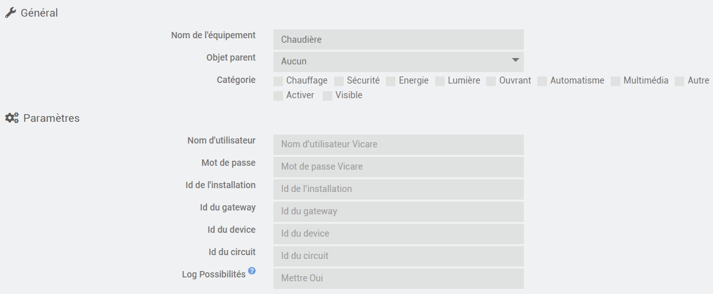
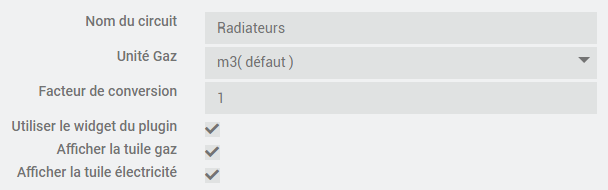

# Plugin viessmann pour Jeedom

    Ce plugin permet de récupérer les informations de votre chaudière Viessmann, cette récupération se fait avec 
    l'API Viessmann écrite par thetrueavatar.
    
## 1. Configuration du plugin

    Rien de particulier dans la configuration de ce plugin, un cronHourly est implémenté pour la cyclique 
    de récupération des données ainsi qu'une action "Rafraichir" qui permet de récupérer les données 
    à la demande.

    Pour l'accès au serveur Viessmann, le nom d'utilisateur et le mot de passe doivent être spécifiés 
    dans les paramètres. Les Ids d'installation et du gateway peuvent être introduits mais ils seront de 
    toute façon récupérés et stockés lors de la première mémorisation des données sur le serveur.

    On peut introduire l'id du device et l'id du circuit, par défaut une valeur nulle est utilisée par le plugin.

    Pour utiliser l'option 'Log Possibilités', vous devez indiquer la valeur Oui ( en respectant la majuscule ) dans le
    zone texte correspondante et passer le log du plugin en mode debug, à la prochaine récupération de données
    toutes les données remontées seront loggées.

    On peut choisir d'utiliser le widget fourni par le plugin ou celui de jeedom
    On peut choisir le nom du circuit
    On peut choisir d'afficher ou pas les tuiles gaz et électricité
    

        
## 1. Widget

    Le plugin dispose de son propre widget qui permet la consultation des informations récupérées 
    sur le serveur. Les différentes icones présentes sur le widget permettent l'accès aux différentes 
    informations.

## 1.1 Résumé

    La tuile affichée par défaut présente un résumé des informations de la chaudière. 
    Premier pavé, avec le mode de fonctionnement de la chaudière et la température mesurée par la sonde extérieure

    Le pavé "Radiateurs" avec la consigne de température et la température de l'eau au départ de la chaudière. 
    Deux icones qui donnent accès aux infos "Radiateurs" et à la programmation.

    Le pavé "Eau chaude" avec la consigne et la température actuelle du boiler. Deux icones qui donnent accès 
    aux infos "Eau chaude" et à la programmation.

    Le pavé "Gaz" qui donne la consommation du jour ( chauffage et eau chaude ) avec une icone qui donne accès 
    aux consommations journalières, hebdomadaires, mensuelles et annuelles. Il s'agit des informations chaudière, 
    ce ne sont pas des informations historisées dans Jeedom.

    Le pavé "Electricité" qui donne la consommation du jour avec une icone qui donne accès aux consommations
    journalières, hebdomadaires, mensuelles et annuelles.

    Et le dernier pavé qui donne la date de la dernière actualisation des informations avec une icone qui permet 
    une actualisation manuelle.
    
